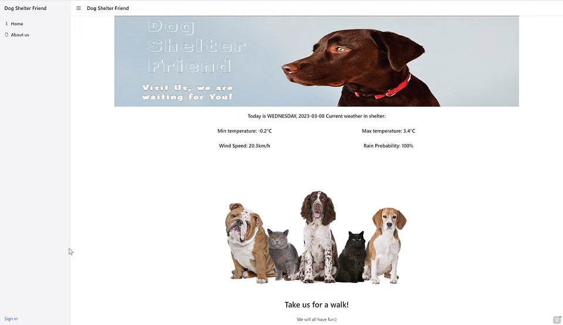
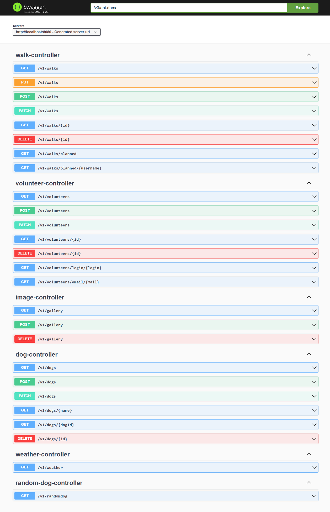

## Dog Shelter Friend - backend

## Opis projektu:

Program zarządza danymi w bazie danych schroniska dla psów, przetrzymuje dane na temat wolontariuszy, psów i zaplanowanych przez wolontariuszy spacerów z psami. Posiada funkcję cyklicznego wysyłania maili do danych wolontariuszy i administratora.  
Każdy wolontariusz ma możliwość założenia konta, przeglądania zdjęć w galerii oraz wybrania psa którym zajmie się podczas spaceru. Użytkownik, po wybraniu pupila którym się zajmie i kliknięciu 'Walk the dog' rejestruje w systemie swoją chęć wyprowadzenia psa w wybranym dniu. Otrzyma także powiadomienie e-mail wysłane na maila podanego przy rejestracji w serwisie.

Pierwszy użytkownik zapisany do bazy danych otrzymuje automatycznie rolę ADMIN, następni zakładający konto mają już automatycznie przydzieloną rolę USER. Admin ma możliwość zmiany roli każdmu USEROWI.
Admin ma dostęp do większej liczby funkcjonalności, np upload zdjęć, przeglądanie listy psów i wolontariuszy, oraz edycji wszystkich danych. Admin może dodać lub usunąć każdego psa lub wolontariusza, oraz anulować zaplanowane wyprowadzenie w przypadku niedostępności psa.

Projekt zrobiono za pomocą:  
- Java 11
- Gradle
- Spring Boot 2.7.

### Uruchomienie aplikacji:

Najpierw należy uruchomić backend (z tego repozytorium), uruchamiając metodę 'main' w klasie DogShelterApplication.java
Nastpnie należy uruchomić frontend aplikacji(Vaadin) znajdujący się w tym repozytorium: https://github.com/gawrysiakg/dog-shelter-friend--frontend-vaadin

oraz:
- Stworzyć bazę danych MySQL o nazwie dogshelter
- utworzyć użytkownika o nazwie: friend , z hasłem: password , oraz nadać mu uprawnienia do operacji na bazie danych.
- plik application.properties zawiera niezbędne klucze i ustawienia do serwisu cloudinary i mailtrap.io by w pełni zaprezentować wszystkie funkcjonalności aplikacji.

### Technologie

- Spring Boot
- Hibernate
- REST API
- MySQL
- JUnit5
- Mockito
- Vaadin (frontend)
- Lombok
- external Cloudinary API
- JavaMailSender

### Cechy aplikacji

- Zewnętrzne API:
    - Cloudinary - upload zdjęć z dysku użytkownika, umieszczenie w serwisie Cloudinary, zapis adresów url do bazy danych, oraz wyświetlenie galerii zdjęć na stronie schroniska.
    - Prognoza pogody - wyświetlanie aktualnej pogody na stronie głównej, wysyłanie maili zachęcających do spaceru z pupilem, informujących też o pogodzie na najbliższe dni.
- Email scheduler - codzienne automatyczne powiadomienie email o ilości zaplanowanych spacerów z psami
- Wzorce projektowe:
    - Fasada
    - Builder
    - Singleton

###
]